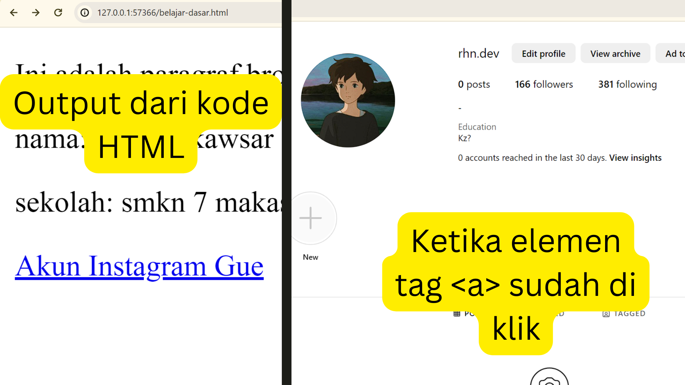

# Anatomi Elemen HTML

```html
<a href="https://instagram.com/rhn.dev">Akun Instagram Gue</a>
```

Elemen HTML adalah bagian dasar dari setiap halaman web. Elemen tersebut dibuat menggunakan tag, yang merupakan kode khusus yang memberitahu browser cara menampilkan konten. Tag biasanya terdiri dari tag pembuka, konten, dan tag penutup.

dalam kode diatas elemen
`<a href="https://instagram.com/rhn.dev">Akun Instagram Gue</a>`,
terdapat 5 bagian utama.

1. `<a href="https://instagram.com/rhn.dev">` : adalah tag pembuka
2. `href` : adalah nama atribut
3. `https://instagram.com/rhn.dev` : adalah nilai atribut
4. `Akun Instagram Gue` : adalah konten
5. `</a>` : adalah tag penutup.

## Tag Pembuka & Penutup

Elemen HTML terdiri dari tag pembuka dan penutup. Tag pembuka dimulai dengan tanda **"<"** dan diakhiri dengan tanda **">"**, sementara tag penutup memiliki sintaks yang serupa, tetapi ditandai dengan tanda **"/"** sebelum nama tag.
Tag pembuka dan penutup adalah bagian dari elemen HTML yang menandai awal dan akhir dari elemen tersebut. Tag pembuka ini biasanya berisi nama tag dan mungkin juga berisi beberapa atribut. Pada kode ini,

```
<a href="https://instagram.com/rhn.dev"> <- adalah tag pembuka dan

<a/> <- adalah tag penutup.
```

Tag pembuka dan penutup ini mengapit konten dan memberitahu browser di mana elemen ini dimulai dan berakhir.

## Atribut Tag

Atribut tag digunakan untuk memberikan informasi tambahan tentang elemen HTML. Atribut ditulis di dalam tag pembuka dan memiliki format nama_atribut="nilai_atribut".
pada kode diatas terdapat atribut href di dalam tag pembuka `<a>`. Atribut href digunakan untuk menentukan URL yang akan dituju oleh hyperlink. Dalam hal ini, nilai atribut href adalah `"<https://www.instagram.com/rhn.dev/>"`, yang merupakan URL dari akun Instagram yang akan ditautkan.

1. Nama Atribut `href`
   Atribut `href` adalah singkatan dari "hypertext reference" dan digunakan untuk menentukan URL atau alamat tujuan dari tautan. Atribut `href` menunjukkan alamat URL yang akan dibuka saat tautan tersebut diklik.
2. Nilai Atribut `https://www.instagram.com/rhn.dev/`
   Nilai atribut `href` adalah URL lengkap yang menunjukkan lokasi atau alamat akun Instagram yang dituju. Dalam kasus ini, nilai "[https://www.instagram.com/rhn.dev/](https://www.instagram.com/rhn.dev/)" menandakan bahwa tautan ini akan membuka halaman akun Instagram dengan nama pengguna "rhn.dev" ketika diklik.

## Isi/Kontent Tag

Isi atau konten tag tersebut, yang terletak di antara tag pembuka `<a>` dan tag penutup `</a>`, adalah teks **"Akun Instagram Gue"**. Dengan kata lain, saat tautan ini diintegrasikan ke dalam halaman HTML, pengguna akan melihat sebuah tautan yang bertuliskan **"Akun Instagram Gue"** dan dapat mengkliknya untuk menuju ke akun Instagram yang terkait. Isi tag memiliki peran penting dalam menentukan apa yang akan muncul sebagai tautan di halaman web, dan dalam hal ini, kontennya mengindikasikan bahwa tautan tersebut mengarahkan ke akun Instagram pribadi

**Hasil Output** :

